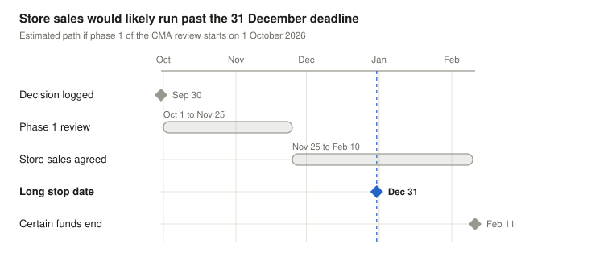

# Ramsdens takeover research note

30 September 2026 · Ebrahim Cahlon

## In brief

I decided not to buy Ramsdens on 30 September 2026, and to keep watching it instead. The takeover pays about 5% if it completes, while the shares could fall 30% to 41% if it fails. The competition review also looks harder than the price suggests.

My central estimate is a 76% chance the deal completes, against roughly 86% needed to break even at today's 644p. I would buy at around 570p to 590p, or if the risk falls, for example if both companies agree more time to complete.

## The situation

Ramsdens runs about 175 pawnbroking and jewellery shops that also exchange currency, mostly in northern England and Scotland. In June 2026 FirstCash, a US company that already owns H&T, the UK's largest pawnbroker, agreed to buy it. After raising its offer, FirstCash now pays 675p a share in cash.

Shareholders and the Financial Conduct Authority have approved the deal. One hurdle remains, the Competition and Markets Authority (CMA), which checks whether a merger would leave customers with too little choice.

The CMA works in two stages. Phase 1 is a review of 40 working days, and if it finds problems the companies can fix them, usually by selling shops. Otherwise the deal goes to phase 2, a deeper investigation that takes about six months.

The deal must complete by 31 December 2026, its long stop date, unless both companies agree to extend it.

| Step | Status on 30 September 2026 |
|---|---|
| Shareholder vote | Approved on 10 August 2026, with 95.6% in favour |
| Financial Conduct Authority | Approved on 31 July 2026 |
| Competition and Markets Authority | Asked for comments in August. Formal phase 1 not yet started |
| Long stop date | 31 December 2026 |

## What the share price says

At 644p, a buyer gains 31p a share, or 4.8%, if the deal completes. If it fails, the shares would likely fall back towards where they traded before the bid. That was 453p on the last day before the offer period, a 30% loss, or 379p on the 12-month average, a 41% loss.

The offer also allowed a 9p dividend, paid on 9 October to holders on the register in September. The shares went ex-dividend on 10 September, so a buyer now receives the 675p only.

Risking 30% to gain 5% only pays if completion is very likely. At 644p the deal needs about an 86% chance of completing to break even, or 90% if the fallback is 379p. That ignores the wait, so the market's real confidence is probably a little higher.

## Why the competition review matters

H&T and Ramsdens are the two largest pawnbroking chains in the UK. Together they have 453 shops, roughly 45% of the country's pawnshops by count.

Using both companies' own store lists, 68 of Ramsdens' 179 shops have an H&T within 1 km, many in the same shopping centre or street. That sits uneasily with the companies' description of a limited overlap, although being close does not by itself mean customers lose out.

The real question is how many other pawnbrokers each area has. A check of the 12 closest overlaps counted rivals within about a mile, the distance used in the last UK pawnbroking merger review, in 2007.

| Who counts as a rival | Areas left with 1 or 2 brands | Areas left with 3 or fewer |
|---|---|---|
| Pawn lenders only | 11 of 12 | 11 of 12 |
| Adding Cash Converters | 9 of 12 | 11 of 12 |
| Adding buy-back shops | 7 of 12 | 11 of 12 |

In 2007 the regulator accepted an area going from four brands to three because new pawnbrokers kept opening. That reason no longer holds, since Ramsdens reports that the number of UK pawnbrokers is falling.

A wider map screen found 37 areas within a mile left with two brands or fewer. A remedy of 30 to 45 shop sales looks likely, and a phase 2 investigation is a real possibility.

## The fine print

The co-operation agreement between the companies requires FirstCash to offer whatever shop sales the CMA needs to clear the deal at phase 1, and not to delay the process (clause 3.2). That promise stops at phase 1, because the condition is only met by a phase 1 clearance.

If the review runs past 31 December, the deal lapses unless both companies agree to extend it, and nothing obliges FirstCash to agree. Walking away earlier, for example after a phase 2 referral, needs the Takeover Panel's permission (clause 9.1(c)).

This is one scenario rather than a forecast. If phase 1 starts in early October, a decision would come in late November or December.

Agreeing shop sales took Asda 77 days after the CMA's finding in 2023. On a similar path the deal runs past 31 December, so it needs FirstCash to agree an extension.

## My estimate

My central estimate is a 76% chance that the deal completes. Each figure below is a judgment, and it will be checked against what actually happens.

| CMA outcome | Chance | Chance it then completes | Why |
|---|---|---|---|
| Phase 1 clearance with no conditions | 5% | About 98% | 11 of the 12 closest areas keep only one or two pawn lenders |
| Phase 1 clearance with shop sales | 60% | About 87% | FirstCash must offer shop sales, but has to agree more time |
| Phase 2 investigation | 35% | About 55% | The shop-sale promise no longer applies, though some deals still complete after phase 2 |
| Total | 100% | About 76% | |

The answer depends on those judgments, so the next table moves them together. The cautious case gives phase 2 a 40% chance with lower odds of completing after it, and the hopeful case gives it 25%.

| Case | Chance it completes | Expected return at 644p | Break-even price, 453p fallback | Break-even price, 379p fallback |
|---|---|---|---|---|
| Cautious | 65% | −7.3% | 597p | 571p |
| Central | 76% | −3.3% | 622p | 605p |
| Hopeful | 86% | −0.1% | 644p | 633p |

Even the hopeful case only breaks even at today's price. A payout in 2027 and room for error argue for buying well below the central break-even, which gives a buy zone of about 570p to 590p.

## What would change my view

I would buy if any of these happened.

- The price falls into the 570p to 590p range with nothing else changed.
- The companies agree to extend the 31 December deadline, which makes the shop-sale route far more certain.
- The CMA accepts shop sales at phase 1.
- A phase 2 referral pushes the price down while FirstCash commits publicly to carry on.

I would drop it if the CMA refers the deal to phase 2 and FirstCash signals it may walk away, or if phase 1 still has not started by mid-November with no extension agreed.

## Method

The data work used a small Python command-line tool. It reads both chains' store lists, places each shop by its postcode using postcodes.io, measures the distances between them and counts rival pawnbrokers from OpenStreetMap. The returns and break-even prices are calculated in the same tool from the published deal terms.

## Limitations

- Only the 12 closest of 72 overlap areas were checked in detail.
- Map data on rival shops is patchy and errs in both directions.
- Distances are straight lines, while the CMA looks at where customers actually travel from.
- The 45% share is by number of shops, not by lending.
- The fallback prices are past share prices, not a valuation of Ramsdens on its own.

## Sources

- [Co-operation agreement between Chess Bidco and Ramsdens, 23 June 2026](https://www.ramsdensplc.com/documents/offer/Co_operation_Agreement_between_Bidco_and_Ramsdens.pdf), which includes the offer announcement
- [Scheme document, 17 July 2026](https://www.ramsdensplc.com/documents/offer/scheme-document-17-july-2026.pdf)
- [Results of the court meeting and general meeting, 10 August 2026](https://www.ramsdensplc.com/documents/offer/results-of-court-meeting-and-general-meeting-10-august-2026.pdf)
- [CMA case page, FirstCash / Ramsdens](https://www.gov.uk/cma-cases/firstcash-slash-ramsdens-merger-inquiry)
- [OFT decision, Albemarle & Bond / Herbert Brown, 2007](https://www.gov.uk/cma-cases/albemarle-bond-holdings-ltd-herbert-brown-son-ltd)
- [CMA merger guidance](https://www.gov.uk/government/publications/merger-assessment-guidelines) and [retail mergers commentary](https://assets.publishing.service.gov.uk/media/5a81e8e840f0b62302699d23/retail-mergers-commentary.pdf)
- [CMA decision on Asda / Arthur, 2023](https://assets.publishing.service.gov.uk/media/64784793b32b9e000ca95fd6/Decision.pdf)
- [Ramsdens store list](https://www.ramsdenspawnbrokers.co.uk/stores), [H&T store finder](https://www.handt.co.uk/store-finder), [postcodes.io](https://postcodes.io) and [OpenStreetMap](https://www.openstreetmap.org)
- Ramsdens annual reports for 2024 and 2025, and FirstCash's annual report on Form 10-K

## Disclosure

Written on 30 September 2026, before the outcome is known.

At the time of writing I hold no position in Ramsdens or FirstCash. This is personal research, not investment advice, and it may contain errors.
